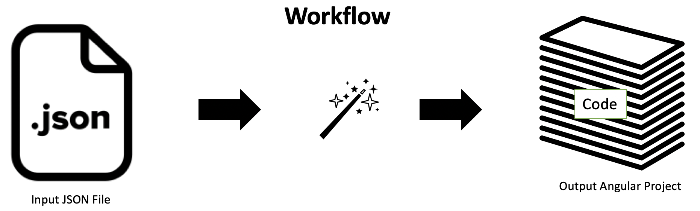

# Magic-Tool
Automation tool for releasing/creating/ a release cycle.

# Motivation
Lets consider a typical release cycle, It has following stages post requirement gathering
1. Sketch user UI Pages and improve them until the stake-holders are happy(Devs,TPM,Arch, etc).
2. Parallely Architects start on the design.
3. TLs gets 2 inputs Desings & Sketch of apps.
4. Execution starts with demo's and feedback flowing back into backlog.
5. After enough features are completed we call it a relase.

In an ideal scenarion this is as simple as any other process & like other processes this can be automated, when considering actual execution cycle we should be able to automate alteast 80% of the process.

Benefits of Automation:
1. Removes the Human Error, Friction,
2. Following of best practices & patterns.
3. Consistency across applications.
4. Reduction of development cycle.

# How does this work?
This tool will try to cover width , currently it only supports following:

- [ ] Mercury
- [ ] Development of UI screens for application by UX personas.

The idea behind the tool or why this was written is as follows:
1. A 

## Tool Json Explained
The following are different sections of tool json
1. Tool json should be named as .magic-tool.json and should be placed in transpiler directory.

## JSON Sections:
1. [Project](documentation/project.md)
2. [Modules](documentation/modules.md)
3. [Components](documentation/components.md)
4. [Layouts](documentation/layouts.md)
5. [Elements](documentation/elements.md)